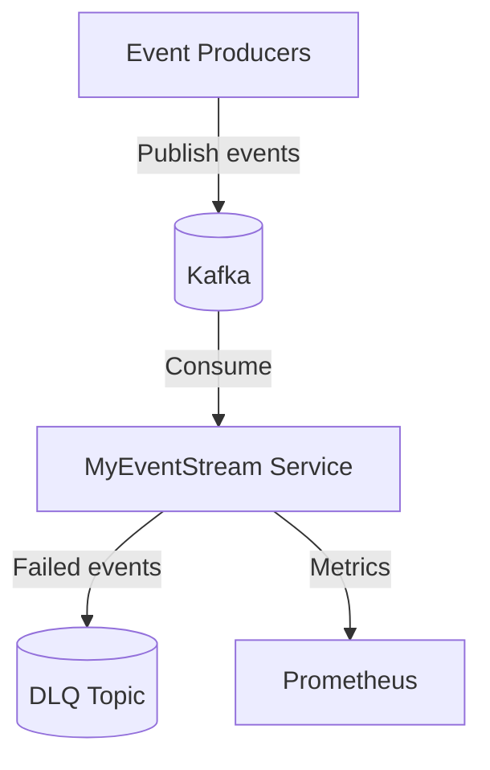
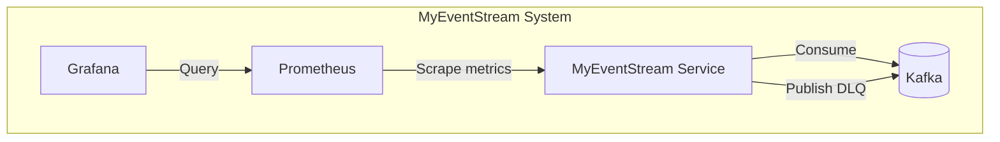

# Architecture Documentation

This document describes the architectural decisions, design patterns, and execution model of the **MyEventStream** event processing service.

**Related Documentation**: [Configuration](./CONFIGURATION.md) | [Running](./RUNNING.md) | [Decisions](./DECISIONS.md)

---

## High-Level Design

The system is a single Go service that consumes events from a message broker, processes them through a controlled pipeline, and handles failures with retries and a dead-letter queue.

**Core Principles**:
- Stateless design — no internal database; broker is the source of truth
- Controlled concurrency and backpressure
- At-least-once delivery semantics
- Fail-safe design with automatic retries and DLQ for permanent failures

**Technical Constraints**:
- **Language**: Go 1.25+ for the service
- **Message Broker**: Kafka (segmentio/kafka-go client)
- **Deployment**: Docker containers orchestrated via Docker Compose
- **Communication**: Kafka consumer/producer for event ingestion and DLQ publishing
- **Observability**: Prometheus metrics, structured logging (zap)

---

## System Context



**Actors**: Event producers (publish to Kafka), operators (monitor the service)  
**External Systems**: Kafka broker (event storage and delivery), optional Prometheus/Grafana for observability

---

## Container Architecture



**Service Details**:
- **MyEventStream**: Event processing service; consumes from configured topic, publishes failed messages to DLQ topic
- **Kafka**: Message broker; source of truth for events
- **Prometheus**: Metrics collection and storage
- **Grafana**: Dashboards for queue depth, throughput, errors (optional, for local development)

**Infrastructure**:
- **Kafka**: Primary event storage; persistent volume for log data
- **Prometheus**: Persistent volume for metrics storage

---

## Service Internal Structure

The service follows a layered architecture:

```
MyEventStream/
├── cmd/                    # Entry point
├── internal/
│   ├── config/             # Configuration loading
│   ├── consumer/           # Kafka consumer (ingestion)
│   ├── queue/              # Bounded internal queue (backpressure)
│   ├── worker/             # Worker pool
│   ├── pipeline/           # Processing stages (decode → validate → process)
│   ├── retry/              # Retry logic with exponential backoff
│   ├── dlq/                # Dead-letter queue producer
│   ├── obs/                # Metrics and HTTP endpoints
│   ├── logger/             # Structured logging
│   └── types/              # Domain types (Event, Payload)
├── loadtest/               # Load testing utilities (Vegeta)
├── prometheus/             # Prometheus configuration
└── grafana/                # Grafana dashboards and provisioning
```

---

## Data Flow & Interaction Patterns

### Key Patterns

1. **Pull-Based Consumption**
   - Kafka consumer fetches messages from the broker
   - Backpressure: bounded queue blocks consumer when full
   - Consumer commits offsets only after successful processing

2. **Processing Pipeline**
   - Explicit stages: decode → validate → process
   - Each stage can fail independently; failures trigger retry or DLQ
   - Pipeline is stateless; no shared mutable state between stages

3. **Broker as Source of Truth**
   - Service does not persist events internally
   - Failed events are published to DLQ topic; offset committed to avoid infinite reprocessing
   - Retries are idempotent-friendly (consumers must tolerate duplicates)

4. **Graceful Shutdown**
   - Context cancellation propagates to consumer and workers
   - In-flight events are processed before exit
   - Shutdown timeout (default 30s) prevents indefinite blocking

### Example Flows

**Successful Processing**: Kafka → consumer → queue → worker → pipeline (decode → validate → process) → commit offset

**Transient Failure**: Kafka → consumer → queue → worker → pipeline (fails) → retry with backoff → pipeline (succeeds) → commit offset

**Permanent Failure**: Kafka → consumer → queue → worker → pipeline (fails after all retries) → DLQ publish → commit offset

---

## Deployment & Infrastructure

**Orchestration**: Docker Compose with bridge network (`myeventstream-network`)

**Persistence**:
- **Kafka**: Persistent volume (`kafka-data`) for log data
- **Prometheus**: Persistent volume (`prometheus-data`) for metrics
- **Grafana**: Persistent volume (`grafana-data`) for dashboards (optional)

**Scaling** (Current: Single Instance):
- Single MyEventStream container; horizontal scaling via consumer groups possible with multiple instances
- Kafka handles partitioning and consumer group coordination

**Configuration**: Environment-driven (see [CONFIGURATION.md](./CONFIGURATION.md))

**Running Locally**: See [RUNNING.md](./RUNNING.md) for setup and execution instructions.

---

## Quality Attributes

### Performance
- Bounded queue and fixed worker pool prevent unbounded resource usage
- Throughput tunable via `QUEUE_BUFFER_SIZE` and `WORKER_POOL_SIZE`
- Under load, ingestion slows (backpressure) instead of failing

### Reliability
- At-least-once delivery; consumers must handle duplicates
- Automatic retries with exponential backoff for transient failures
- DLQ captures permanently failed messages for offline inspection and replay
- Graceful shutdown ensures in-flight events are processed

### Observability
- Structured logging (JSON) via zap
- Prometheus metrics: `queue_depth`, `events_ingested_total`, `events_processed_total`, `retry_attempts_total`, `dlq_messages_total`, `retry_exhausted_total`
- Metrics HTTP endpoint for Prometheus scraping (default port 8080)
- Grafana dashboards for queue depth and throughput visualization

---

## Technology Stack

**Language**: Go 1.25+

**Message Broker**: Kafka (Confluent Platform image), segmentio/kafka-go client

**Key Libraries**:
- Kafka: `segmentio/kafka-go`
- Metrics: `prometheus/client_golang`
- Logging: `go.uber.org/zap`
- Config: `joho/godotenv`

**Infrastructure**: Docker, Docker Compose, Prometheus, Grafana

---

## Architecture Decision Records

Key architectural decisions are documented in [DECISIONS.md](./DECISIONS.md). Summary:

1. **Single External Broker**: Kafka or NATS as source of truth; MyEventStream is not a broker replacement
2. **At-Least-Once Delivery**: Simpler than exactly-once; consumers tolerate duplicates
3. **Bounded Internal Queue**: Backpressure prevents unbounded memory growth
4. **Fixed Worker Pool**: Predictable concurrency, avoids goroutine explosion
5. **Explicit Pipeline Stages**: Decode → validate → process for testability and clarity
6. **Retry with Exponential Backoff**: Configurable retries before DLQ
7. **DLQ for Failed Messages**: Prevents poison messages from blocking the pipeline
8. **Environment-Based Configuration**: 12-factor app principles
